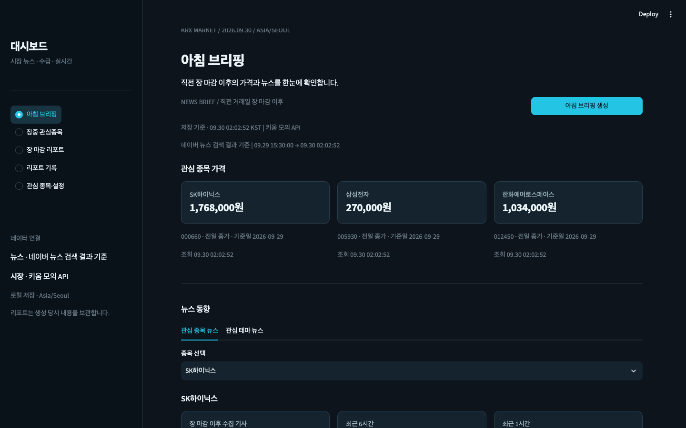
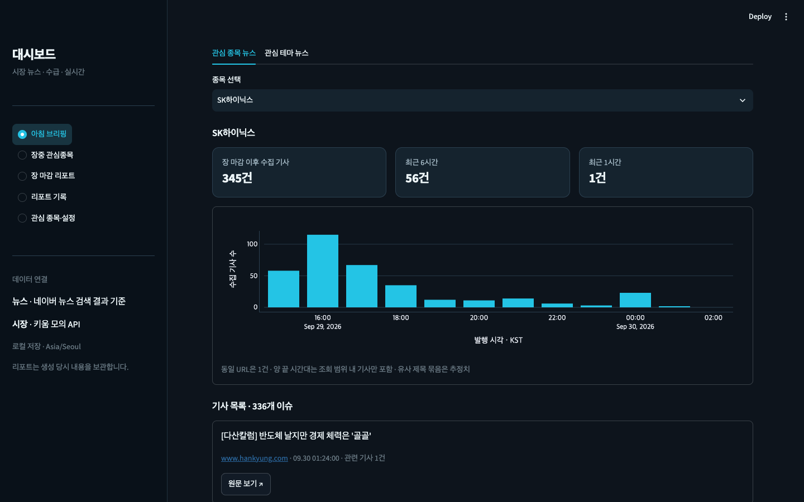

# 대시보드

관심 종목의 뉴스, 시장 전체의 외국인·기관 수급, 장중 체결을 한곳에 모아보는 로컬 대시보드입니다. 뉴스의 의미와 날짜별 비교는 사용자가 직접 판단합니다.





위 화면은 실제 API로 생성한 로컬 리포트의 예입니다. 수치와 기사 목록은 실행 시점과 사용자 설정에 따라 달라집니다.

## 실행

Python 3.11 이상이 필요합니다. 프로젝트 폴더에서 실행하세요.

```bash
python3 -m venv .venv
source .venv/bin/activate
python -m pip install -e '.[dev]'
streamlit run app.py
```

터미널에 표시된 로컬 주소를 브라우저에서 엽니다. 기본값은 <http://127.0.0.1:8501>이며 이미 사용 중이면 다음 포트가 선택될 수 있습니다. API 키가 없으면 해당 조회 기능은 비활성화되며 가상 데이터는 표시하지 않습니다.

uv를 사용하는 경우 `uv sync --extra dev` → `uv run streamlit run app.py`로 실행할 수 있습니다.

## 화면

아침에는 종목·테마 뉴스의 시간대별 발생량과 기사 원문을, 장 마감에는 외국인·기관 순매수·순매도 상위 종목과 업종 분포를 확인합니다. 장중에는 키움 WebSocket 체결 흐름을 볼 수 있습니다.

| 화면 | 기능 |
|---|---|
| 아침 브리핑 | 가격 스냅샷, 종목·테마 뉴스, 유사 제목 묶기, 시간당 기사 수 |
| 장중 관심종목 | WebSocket 체결가·등락률·체결량, 최근 가격 차트, 시작·중지 |
| 장 마감 리포트 | 코스피/코스닥별 외국인·기관 순매수/순매도 금액 Top 10, 거래대금 Top 10, 업종 차트 |
| 리포트 기록 | 날짜·종류·생성 시각으로 불변 스냅샷 열람 |
| 관심 종목·설정 | 종목 등록·삭제, 테마 키워드 편집, 종목-테마 연결, 공급자 설정 상태 |

새 DB는 빈 관심 목록으로 시작합니다. 사용자가 등록한 관심 종목·테마는 로컬 SQLite에 저장됩니다.

## API 키 연결

```bash
cp .env.example .env
```

`.env`에서 아래 빈 값만 직접 채우고 서버를 재시작합니다. 실제 키를 GitHub나 대화창에 넣지 않습니다.

```dotenv
NAVER_CLIENT_ID=
NAVER_CLIENT_SECRET=
KIWOOM_APP_KEY=
KIWOOM_APP_SECRET=
KIWOOM_ENV=mock
DASHBOARD_DB_PATH=data/dashboard.db
```

- 네이버: NAVER API HUB에서 뉴스 검색 API를 선택한 Application을 등록하고, 발급된 Client ID/Secret을 `NAVER_CLIENT_ID`/`NAVER_CLIENT_SECRET`에 입력합니다. 기존 NAVER Developers Center 키와는 호환되지 않습니다.
- 키움: `mock`에는 모의 환경에서 발급한 키를 입력합니다. 운영 시세 조회는 운영 키와 `KIWOOM_ENV=real`을 함께 설정합니다. 주문 기능은 없습니다.
- 각 공급자의 키 두 개가 모두 있으면 API 모드입니다. 비어 있거나 일부만 있으면 해당 기능은 비활성화되고 설정 상태가 표시됩니다.
- 실제 API 오류나 0건 결과는 가상 데이터로 대체하지 않습니다. 부분 실패는 화면과 저장 리포트에 남습니다.
- 이전 버전에서 만든 가상 리포트는 일반 화면과 기록 목록에서 숨기지만, 기존 SQLite 원본은 삭제하지 않습니다. 관심 목록도 보존합니다.

## 구조

```text
app.py → src/ui → src/services → src/providers
                       ↓              ↓
                src/repositories   키움 / 네이버
                       ↓
                  SQLite (.db)
```

Python / Streamlit / Plotly / SQLite / httpx / websockets. 서비스는 UI 프레임워크에 의존하지 않으며 공급자는 공통 모델로 데이터를 반환합니다. 비밀정보·토큰·DB 파일은 버전 관리에서 제외됩니다.

## 검증

```bash
python -m pytest -q
ruff check .
ruff format --check .
```

자동 테스트는 테스트 대체 공급자를 사용하므로 네트워크와 실제 키 없이 실행됩니다. HTTP 응답 파싱·페이지 처리·금액 단위·휴장일·뉴스 중복·리포트 보존·실시간 버퍼/정리·Streamlit 화면 흐름을 검증합니다. 2026-09-30 실제 키로 NAVER API HUB 뉴스 단독 조회와 키움 모의 REST 시세·순위 조회 및 WebSocket 구독 응답을 확인했습니다. 전체 UI 생성 흐름과 실시간 체결 수신은 별도 검증 대상입니다. 실제 API 호출 결과는 키와 권한·시장 시간에 따라 달라질 수 있습니다.

## SDD 기록

- [PRD](docs/PRD.md) · [요구사항](REQUIREMENTS.md) · [디자인 시스템](docs/DESIGN_SYSTEM.md)
- [아키텍처](docs/ARCHITECTURE.md) · [설계 결정](docs/ADR.md)
- [구현 계획 및 결과](docs/IMPLEMENTATION_PLAN.md) · [구현 기준 보완](docs/IMPLEMENTATION_NOTES.md)
- [아침](docs/specs/MORNING_NEWS_BRIEF.md) · [수급](docs/specs/EVENING_FLOW_REPORT.md) · [실시간](docs/specs/LIVE_WATCHLIST.md)

명세 협의 → 승인 → 단계별 구현·테스트 → 화면 검증을 기록했습니다. NH선물 API 자체를 연동한 프로젝트는 아니며, API 인증·금융 데이터 정규화·WebSocket·실패 처리 역량을 보여주는 포트폴리오입니다.

공식 자료: [키움 API 명세](https://github.com/Kiwoom-Securities/Kiwoom-REST-API), [NAVER API HUB 뉴스 검색](https://api.ncloud-docs.com/docs/naver-api-hub-search-news), [NAVER API HUB 이관 가이드](https://guide.ncloud-docs.com/docs/apihub-migration).
