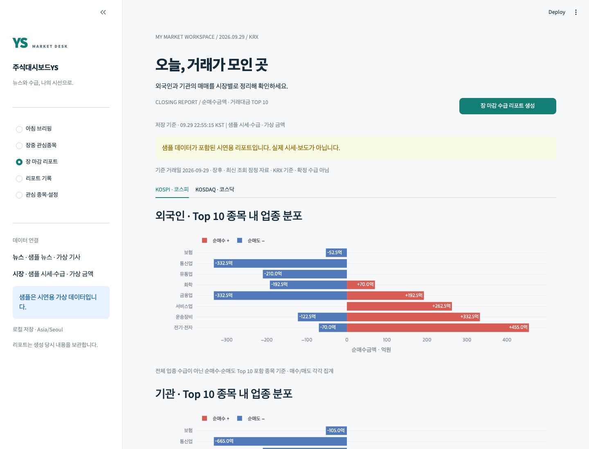
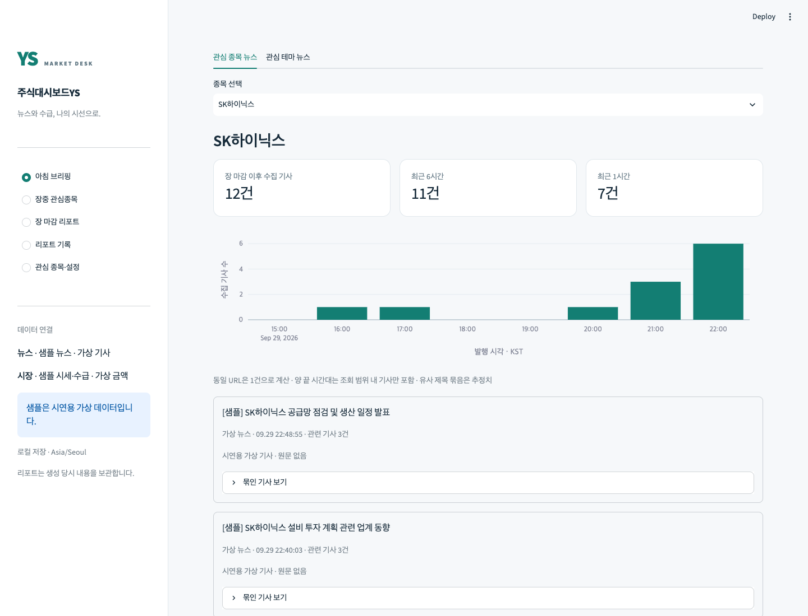
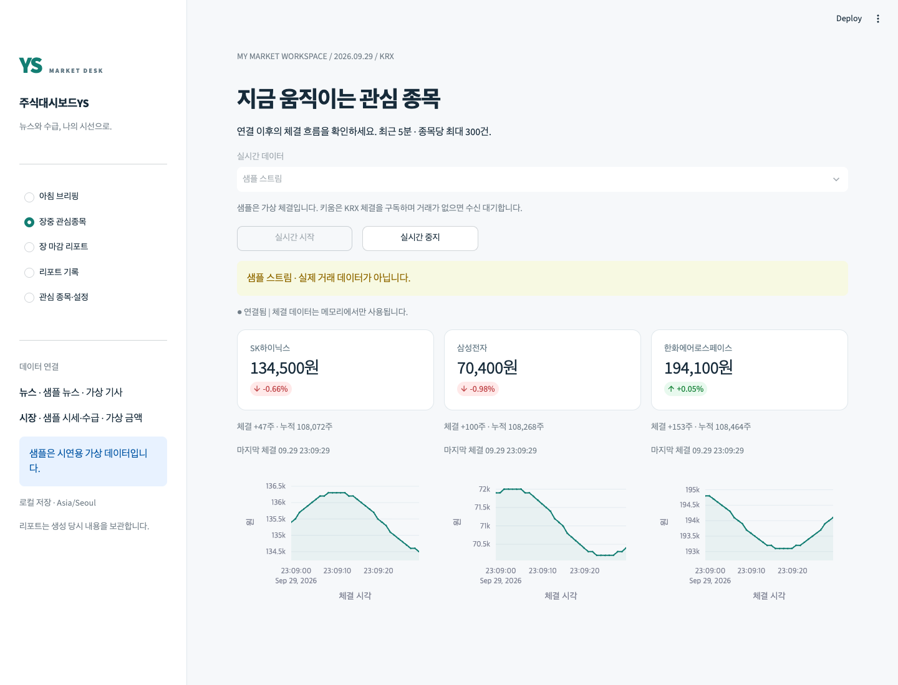

# 주식대시보드YS

관심 종목의 뉴스, 시장 전체의 외국인·기관 수급, 장중 체결을 한곳에 모아보는 로컬 대시보드입니다. 뉴스의 의미와 날짜별 비교는 사용자가 직접 판단합니다.

## 실행

Python 3.11 이상이 필요합니다. 프로젝트 폴더에서 실행하세요.

```bash
python3 -m venv .venv
source .venv/bin/activate
python -m pip install -e '.[dev]'
streamlit run app.py
```

브라우저에서 <http://127.0.0.1:8501>을 엽니다. API 키 없이 모든 화면을 샘플 데이터로 실행할 수 있습니다. 샘플의 기사·금액·체결은 가상 데이터이며 화면과 저장 리포트에 표시됩니다.

uv를 사용하는 경우 `uv sync --extra dev` → `uv run streamlit run app.py`로 실행할 수 있습니다.

## 화면

장 마감에는 외국인·기관의 순매수와 순매도를 Top 10 종목의 업종별로 펼쳐 보여줍니다.



아침에는 종목·테마 뉴스의 시간대별 발생량과 기사 원문을 확인합니다. [가격 카드가 포함된 전체 상단 화면](docs/images/morning.png)도 볼 수 있습니다.



장중에는 관심 종목의 체결가 흐름을 WebSocket으로 확인합니다.



| 화면 | 기능 |
|---|---|
| 아침 브리핑 | 가격 스냅샷, 종목·테마 뉴스, 유사 제목 묶기, 시간당 기사 수 |
| 장중 관심종목 | WebSocket 체결가·등락률·체결량, 최근 가격 차트, 시작·중지 |
| 장 마감 리포트 | 코스피/코스닥별 외국인·기관 순매수/순매도 금액 Top 10, 거래대금 Top 10, 업종 차트 |
| 리포트 기록 | 날짜·종류·생성 시각으로 불변 스냅샷 열람 |
| 관심 종목·설정 | 종목 등록·삭제, 테마 키워드 편집, 종목-테마 연결, 공급자 설정 상태 |

샘플 초기 종목은 삼성전자, SK하이닉스, 한화에어로스페이스입니다. 빈 DB 최초 실행에 한 번만 생성하며, 사용자가 삭제한 항목은 다시 생성하지 않습니다.

## API 키 연결

```bash
cp .env.example .env
```

`.env`에서 아래 빈 값만 직접 채우고 서버를 재시작합니다. 실제 키를 GitHub나 대화창에 넣지 않습니다.

```dotenv
NAVER_CLIENT_ID=
NAVER_CLIENT_SECRET=
KIWOOM_APP_KEY=
KIWOOM_APP_SECRET=
KIWOOM_ENV=mock
YS_DB_PATH=data/dashboard.db
```

- 네이버: NAVER API HUB에서 뉴스 검색 API를 선택한 Application을 등록하고, 발급된 Client ID/Secret을 `NAVER_CLIENT_ID`/`NAVER_CLIENT_SECRET`에 입력합니다. 기존 NAVER Developers Center 키와는 호환되지 않습니다.
- 키움: `mock`에는 모의 환경에서 발급한 키를 입력합니다. 운영 시세 조회는 운영 키와 `KIWOOM_ENV=real`을 함께 설정합니다. 주문 기능은 없습니다.
- 각 공급자의 키 두 개가 모두 비어 있으면 해당 공급자만 샘플 모드입니다. 두 개 모두 있으면 API 모드, 일부만 있으면 설정 오류입니다.
- 실제 API 오류를 샘플 성공으로 대체하지 않습니다. 부분 실패는 화면과 저장 리포트에 남습니다.
- 장이 닫혀도 실시간 화면에서 `샘플 스트림`을 직접 선택해 시연할 수 있습니다.

## 데이터 기준과 한계

- 뉴스: 직전 KRX 거래일 장 마감부터 생성 시점까지, 네이버 날짜순 검색 결과입니다. 키워드당 최대 1,000건을 조회하고 상한에 도달하면 알립니다. 출처는 원문 도메인입니다. 기사 본문은 수집하지 않습니다.
- 같은 URL을 제거하고 제목 유사도로 기사를 묶습니다. 이슈 분류는 완벽하지 않으며 관련성이 다른 기사도 함께 묶일 수 있습니다. 시간대별 숫자는 전체 언론 보도량이 아닌 수집 기사 수입니다.
- 수급: `ka10065`, `amt_qty_tp=1` 금액 기준. 거래대금: `ka10032`. 백만원 원본을 원으로 정규화하고 화면은 억원으로 표시합니다.
- 수급 순위는 최신 **잠정 자료**입니다. 과거 날짜 재조회와 확정 수급을 지원하지 않습니다. 실제 수급 조회는 거래일 장 시작 이후에 허용됩니다. 시장 전체 종목의 완전한 자금 흐름을 뜻하지 않습니다.
- 업종: `ka10099`의 `upName`. 없는 값은 미분류입니다. 차트는 **매수·매도 Top 10 내 종목**만 각각 합산합니다.
- 장전 가격은 전일 종가를 사용합니다. 검증할 수 없는 등락률·미제공 필드는 빈칸입니다. 가격 기준일과 조회 시각을 구분합니다.
- 실시간: 키움 `0B` 체결 구독. 연결 이후 최근 5분·최대 300건만 메모리에 유지합니다. 화면은 1초마다 갱신합니다. 종목이 활발하면 300건 제한 때문에 표시 구간이 5분보다 짧을 수 있습니다.
- 창 종료 시 UI heartbeat가 30초 끊기면 연결이 정리됩니다. 중지 및 메뉴 이동 시에도 정리됩니다.
- 휴장일·특별 개장 시간은 `exchange-calendars`의 XKRX 달력을 사용합니다. 거래소 임시 변경 사항은 라이브러리 업데이트가 필요할 수 있습니다.
- 실시간 이벤트는 DB에 저장하지 않습니다. 리포트 재생성은 별도 버전으로 추가하며 이전 결과를 덮어쓰지 않습니다.

## 구조

```text
app.py → src/ui → src/services → src/providers
                       ↓              ↓
                src/repositories   키움 / 네이버 / 샘플
                       ↓
                  SQLite (.db)
```

Python / Streamlit / Plotly / SQLite / httpx / websockets. 서비스는 UI 프레임워크에 의존하지 않으며 공급자는 공통 모델로 데이터를 반환합니다. 비밀정보·토큰·DB 파일은 버전 관리에서 제외됩니다.

## 검증

```bash
python -m pytest -q
ruff check .
ruff format --check .
```

자동 테스트는 네트워크와 실제 키 없이 실행합니다. HTTP 응답 파싱·페이지 처리·금액 단위·휴장일·뉴스 중복·리포트 보존·실시간 버퍼/정리·Streamlit 화면 흐름을 검증합니다. 2026-09-30 실제 키로 NAVER API HUB 뉴스 단독 조회와 키움 모의 REST 시세·순위 조회 및 WebSocket 구독 응답을 확인했습니다. 전체 UI 생성 흐름과 실시간 체결 수신은 별도 검증 대상입니다. 실제 API 호출 결과는 키와 권한·시장 시간에 따라 달라질 수 있습니다.

## SDD 기록

- [PRD](docs/PRD.md) · [요구사항](REQUIREMENTS.md)
- [아키텍처](docs/ARCHITECTURE.md) · [설계 결정](docs/ADR.md)
- [구현 계획 및 결과](docs/IMPLEMENTATION_PLAN.md) · [구현 기준 보완](docs/IMPLEMENTATION_NOTES.md)
- [아침](docs/specs/MORNING_NEWS_BRIEF.md) · [수급](docs/specs/EVENING_FLOW_REPORT.md) · [실시간](docs/specs/LIVE_WATCHLIST.md)

명세 협의 → 승인 → 단계별 구현·테스트 → 화면 검증을 기록했습니다. NH선물 API 자체를 연동한 프로젝트는 아니며, API 인증·금융 데이터 정규화·WebSocket·실패 처리 역량을 보여주는 포트폴리오입니다.

공식 자료: [키움 API 명세](https://github.com/Kiwoom-Securities/Kiwoom-REST-API), [NAVER API HUB 뉴스 검색](https://api.ncloud-docs.com/docs/naver-api-hub-search-news), [NAVER API HUB 이관 가이드](https://guide.ncloud-docs.com/docs/apihub-migration).
